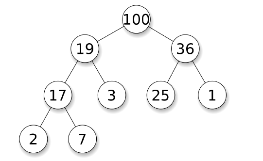

# C++中数据结构的使用

## C++ `STL`（部分）

> 只有理解了这些数据结构的原理和使用方法，才能够更加游刃有余地解决算法和数据结构问题。

在刷题时，我们几乎一定会用到各种数据结构来辅助我们解决问题，因此我们必须熟悉各种数据结构的特点。C++ `STL` 提供的数据结构包括（实际底层细节可能因编译器而异）：
1. `Sequence Containers`：维持顺序的容器。
(a). `vector`：动态数组，是我们最常使用的数据结构之一，用于O(1) 的随机读取。因为大部分算法的时间复杂度都会大于O(n)，因此我们经常新建vector 来存储各种数据或中间变量。因为在尾部增删的复杂度是O(1)，我们也可以把它当作stack 来用。
(b). `list`：双向链表，也可以当作stack 和queue 来使用。由于`LeetCode` 的题目多用Node 来表示链表，且链表不支持快速随机读取，因此我们很少用到这个数据结构。一个例外是经典的`LRU` 问题，我们需要利用链表的特性来解决，我们在后文会遇到这个问题。
(c). `deque`：双端队列，这是一个非常强大的数据结构，既支持O(1) 随机读取，又支持O(1)时间的头部增删和尾部增删，不过有一定的额外开销。
(d). `array`：固定大小的数组，一般在刷题时我们不使用。
(e). `forward_list`：单向链表，一般在刷题时我们不使用。
2. `Container Adaptors`：基于其它容器实现的数据结构。
(a). `stack`：后入先出（LIFO）的数据结构，默认基于`deque` 实现。stack 常用于深度优先搜索、一些字符串匹配问题以及单调栈问题。
(b). `queue`：先入先出（FIFO）的数据结构，默认基于`deque` 实现。queue 常用于广度优先搜索。
(c). `priority_queue`：最大值先出的数据结构，默认基于`vector` 实现堆结构。它可以在O(n log n)的时间排序数组，O(log n) 的时间插入任意值，O(1) 的时间获得最大值，O(log n) 的时间删除最大值。priority_queue 常用于维护数据结构并快速获取最大或最小值。
3. `Associative Containers`：实现了排好序的数据结构。
    (a). `set`：有序集合，元素不可重复，底层实现默认为红黑树，即一种特殊的二叉查找树（`BST`）。它可以在O(n log n) 的时间排序数组，O(log n) 的时间插入、删除、查找任意值，O(log n) 的时间获得最小或最大值。这里注意，set 和priority_queue 都可以用于维护数据结构并快速获取最大最小值，但是它们的时间复杂度和功能略有区别，如priority_queue 默认不支持删除任意值，而set 获得最大或最小值的时间复杂度略高，具
    体使用哪个根据需求而定。
    (b). `multiset`：支持重复元素的set。

  (c). `map`：有序映射或有序表，在set 的基础上加上映射关系，可以对每个元素key 存一个值value。
  (d). `multimap`：支持重复元素的map。

4. `Unordered Associative Containers`：对每个Associative Containers 实现了哈希版本。
    (a). `unordered_set`：哈希集合，可以在O(1) 的时间快速插入、查找、删除元素，常用于快速的查询一个元素是否在这个容器内。
    (b). `unordered_multiset`：支持重复元素的unordered_set。
    (c). `unordered_map`：哈希映射或哈希表，在unordered_set 的基础上加上映射关系，可以对每一个元素key 存一个值value。在某些情况下，如果key 的范围已知且较小，我们也可以用vector 代替unordered_map，用位置表示key，用每个位置的值表示value。
    (d). `unordered_multimap`：支持重复元素的unordered_map。


## 数组

#### [448. 找到所有数组中消失的数字](https://leetcode-cn.com/problems/find-all-numbers-disappeared-in-an-array/)

``` c++
//利用数组这种数据结构建立n 个桶
vector<int> findDisappearedNumbers(vector<int>& nums) {
    vector<int> ans;
    for (const int & num: nums) {
        int pos = abs(num) - 1;
        if (nums[pos] > 0) {
            nums[pos] = -nums[pos];
        }
    }
    for (int i = 0; i < nums.size(); ++i) {
        if (nums[i] > 0) {
            ans.push_back(i + 1);
        }
    }
    return ans;
}
```

#### [48. 旋转图像](https://leetcode-cn.com/problems/rotate-image/)

``` c++
void rotate(vector<vector<int>>& matrix) {
    int temp, n = matrix.size() - 1;
    for (int i = 0; i <= n / 2; ++i) {
        for (int j = i; j < n - i; ++j) {
            temp = matrix[i][n - j];
            matrix[i][n - j] = matrix[j][i];
            matrix[j][i] = matrix[n - i][j];
            matrix[n - i][j] = matrix[n - j][n - i];
            matrix[n - j][n - i] = temp;
        }
    }
}
```

#### [240. 搜索二维矩阵 II](https://leetcode-cn.com/problems/search-a-2d-matrix-ii/)

``` c++
bool searchMatrix(vector<vector<int>>& matrix, int target) {
    int m = matrix.size(), n = matrix[0].size(), i = 0, j = n - 1;
    while (i < m && j >= 0) {
        if (target > matrix[i][j]) {
            ++i;
        } else if (target < matrix[i][j]) {
            --j;
        } else {
            return true;
        }
    }
    return false;
}
```

#### [769. 最多能完成排序的块](https://leetcode-cn.com/problems/max-chunks-to-make-sorted/)

``` c++
//cur_max只可能大于等于i
//if cur_max > i : arr[i]右边存在小于arr[i]的数
//if cur_max = i : arr[i]可以独立分割
int maxChunksToSorted(vector<int>& arr) {
    int chunks = 0, cur_max = 0;
    for (int i = 0; i < arr.size(); ++i) {
        cur_max = max(cur_max, arr[i]);
        if (cur_max == i) {
            ++chunks;
        }
    }
    return chunks;
}
```


## 栈和队列

#### [232. 用栈实现队列](https://leetcode-cn.com/problems/implement-queue-using-stacks/)

``` c++
class MyQueue {
stack<int> in, out;
public:
    MyQueue() {}
    void push(int x) {
        in.push(x);
    }
    int pop() {
        in2out();
        int x = out.top();
        out.pop();
        return x;
    }
    int peek() {
        in2out();
        return out.top();
    }
    void in2out() {
        if (out.empty()) {
            while (!in.empty()) {
                int x = in.top();
                in.pop();
                out.push(x);
            }
        }
    }
    bool empty() {
        return in.empty() && out.empty();
    }
};
```

#### [155. 最小栈](https://leetcode-cn.com/problems/min-stack/)

``` c++
class MinStack {
stack<int> s, min_s;
public:
    MinStack() {}
    void push(int x) {
        s.push(x);
        if (min_s.empty() || min_s.top() >= x) {
            min_s.push(x);
        }
    }
    void pop() {
        if (!min_s.empty() && min_s.top() == s.top()) {
            min_s.pop();
        }
        s.pop();
    }
    int top() {
        return s.top();
    }
    int getMin() {
        return min_s.top();
    }
};
```

#### [20. 有效的括号](https://leetcode-cn.com/problems/valid-parentheses/)

``` c++
bool isValid(string s) {
    stack<char> parsed;
    for (int i = 0; i < s.length(); ++i) {
        if (s[i] == '{' || s[i] == '[' || s[i] == '(') {
            parsed.push(s[i]);
        } else {
            if (parsed.empty()) {
                return false;
            }
            char c = parsed.top();
            if ((s[i] == '}' && c == '{') ||
                (s[i] == ']' && c == '[') ||
                (s[i] == ')' && c == '(')) {
                parsed.pop();
            } else {
                return false;
            }
        }
    }
    return parsed.empty();
}
```

## 单调栈monotone stack

单调栈通过维持栈内值的单调递增（递减）性，在整体O(n) 的时间内处理需要大小比较的问题。

#### [739. 每日温度](https://leetcode-cn.com/problems/daily-temperatures/)

``` c++
vector<int> dailyTemperatures(vector<int>& temperatures) {
    int n = temperatures.size();
    vector<int> ans(n);
    stack<int> indices; // 从栈底到栈顶的下标对应的温度列表中的温度依次递减
    					// 表示未找到更大的温度
    for (int i = 0; i < n; ++i) {
        while (!indices.empty()) {
            int pre_index = indices.top(); 
            if (temperatures[i] <= temperatures[pre_index]) {
                break;
            }
            //如果后一个下标对应的温度大于前一个下标对应的温度，则弹栈并更新对应下标值
            indices.pop();
            ans[pre_index] = i - pre_index;
        }
        indices.push(i);
    }
    return ans;
}
```

#### [42. 接雨水](https://leetcode-cn.com/problems/trapping-rain-water/)

``` c++
int trap(vector<int>& height) {
    int ans = 0;
    stack<int> stk;
    int n = height.size();
    for (int i = 0; i < n; ++i) {
        while (!stk.empty()) {
            int top = stk.top();
            if (height[i] <= height[top]) {
                break;
            }
            stk.pop();
            if (stk.empty()) {
                break;
            }
            int left = stk.top();
            int currWidth = i - left - 1;
            int currHeight = min(height[left], height[i]) - height[top];
            ans += currWidth * currHeight;
        }
        stk.push(i);
    }
    return ans;
}
```

#### [84. 柱状图中最大的矩形](https://leetcode-cn.com/problems/largest-rectangle-in-histogram/)

**注意哨兵技巧的应用**

``` c++
// monostack + sentinel
int largestRectangleArea(vector<int>& heights) {
    heights.push_back(0); 
    int n = heights.size(), ans = 0;

    stack<int> st;
    st.push(0);

    for(int i = 1; i < n; i++){
        while(!st.empty() && heights[st.top()] > heights[i]){
            int tmp = st.top();
            st.pop();
            int wid = i;
            if(!st.empty()) wid = i - st.top() - 1;
            ans = max(ans, wid * heights[tmp]);
        }
        st.push(i);
    }
    return ans;
}
```

#### [496. 下一个更大元素 I](https://leetcode-cn.com/problems/next-greater-element-i/)

``` c++
vector<int> nextGreaterElement(vector<int>& nums1, vector<int>& nums2) {
    vector<int> ans(nums1.size(), -1);
    stack<int> st;
    unordered_map<int, int> hash;
    for (int num : nums2) {
        while (!st.empty() && num > st.top()) {
            int top = st.top();
            st.pop();
            hash[top] = num;
        }
        st.push(num);
    }
    for (int i = 0; i < nums1.size(); ++i) {
        if (hash.count(nums1[i]) != 0) ans[i] = hash[nums1[i]];
    }
    return ans;
}
```

#### [316. 去除重复字母](https://leetcode-cn.com/problems/remove-duplicate-letters/)

``` c++
// greedy + monostack
string removeDuplicateLetters(string s) {
    vector<int> vis(26), num(26);
    for (char ch : s) {
        num[ch - 'a']++;
    }

    string stk; // 使用string的pop_back()和push_back()当作栈使用
    for (char ch : s) {
        if (!vis[ch - 'a']) {
            while (!stk.empty() && stk.back() > ch) {
                //每次都判断非空，可使用哨兵简化
                if (num[stk.back() - 'a'] > 0) {
                    vis[stk.back() - 'a'] = 0;
                    stk.pop_back();
                } else {
                    break;
                }
            }
            vis[ch - 'a'] = 1;
            stk.push_back(ch);
        }
        num[ch - 'a'] -= 1;
    }
    return stk;
}
```

#### [901. 股票价格跨度](https://leetcode-cn.com/problems/online-stock-span/)

``` c++

```

#### [402. 移掉 K 位数字](https://leetcode-cn.com/problems/remove-k-digits/)

``` c++

```

#### [581. 最短无序连续子数组](https://leetcode-cn.com/problems/shortest-unsorted-continuous-subarray/)

``` c++

```

## 优先队列

**优先队列（priority queue）**可以在`O(1) `时间内获得最大值，并且可以在`O(log n) `时间内取出最大值或插入任意值。

优先队列具有队列（queue头文件中）的所有特性，包括基本操作，只是在这基础上添加了内部的一个排序。

优先队列常常用**堆（heap）**来实现。堆是一个完全二叉树，其每个节点的值总是大于等于子节点的值。实际实现堆时，我们通常用一个数组而不是用指针建立一个树。这是因为堆是完全二叉树，所以用数组表示时，位置i 的节点的父节点位置一定为`i/2`，而它的两个子节点的位置又一定分别为`2i` 和`2i+1`。
以下是**堆的实现方法**，其中最核心的两个操作是上浮和下沉：

- **上浮**：如果一个节点比父节点大，那么需要交换这个两个节点；交换后还可能比它新的父节点大，因此需要不断地进行比较和交换操作；
- **下沉**：类似地，如果一个节点比父节小，也需要不断地向下进行比较和交换操作。如果一个节点有两个子节点，我们总是交换最大的子节点。



​													图：（最大）堆，维护的是数据结构中的大于关系

``` c++
vector<int> heap;
// 获得最大值
void top() {
    return heap[0];
}
// 插入任意值：把新的数字放在最后一位，然后上浮
void push(int k) {
    heap.push_back(k);
    swim(heap.size() - 1);
}
// 删除最大值：把最后一个数字挪到开头，然后下沉
void pop() {
    heap[0] = heap.back();
    heap.pop_back();
    sink(0);
}
// 上浮
void swim(int pos) {
    while (pos > 1 && heap[pos/2] < heap[pos])) {
        swap(heap[pos/2], heap[pos]);
        pos /= 2;
    }
}
// 下沉
void sink(int pos) {
    while (2 * pos <= N) {
        int i = 2 * pos;
        if (i < N && heap[i] < heap[i+1]) ++i;
        if (heap[pos] >= heap[i]) break;
        swap(heap[pos], heap[i]);
        pos = i;
    }
}
```

通过将算法中的大于号和小于号互换，我们也可以得到一个快速获得**最小值的优先队列**。

另外，和`STL `章节提到的一样，如果我们需要在维持大小关系的同时，还需要支持查找任意值、删除任意值、维护所有数字的大小关系等操作，可以考虑使用set 或map 来代替优先队列。

c++ 中优先队列使用如下：

``` c++
定义：priority_queue<Type, Container, Functional>
Type 就是数据类型，Container 就是容器类型（Container必须是用数组实现的容器，比如vector,deque等等，但不能用 list。STL里面默认用的是vector），Functional 就是比较的方式，当需要用自定义的数据类型时才需要传入这三个参数，使用基本数据类型时，只需要传入数据类型，默认是大顶堆。
一般是：
//升序队列
priority_queue <int,vector<int>,greater<int> > q;
//降序队列
priority_queue <int,vector<int>,less<int> >q;

//greater和less是std实现的两个仿函数（就是使一个类的使用看上去像一个函数。其实现就是类中实现一个operator()，这个类就有了类似函数的行为，就是一个仿函数类了）
其中pair的比较，先比较第一个元素，第一个相等比较第二个
```

#### [23. 合并K个升序链表](https://leetcode-cn.com/problems/merge-k-sorted-lists/)

``` c++
struct Comp {
    bool operator() (ListNode* l1, ListNode* l2) {
        return l1->val > l2->val;
    }
};
ListNode* mergeKLists(vector<ListNode*>& lists) {
    if (lists.empty()) return nullptr;
    priority_queue<ListNode*, vector<ListNode*>, Comp> q;
    for (ListNode* list: lists) {
        if (list) {
            q.push(list);
        }
    }
    ListNode* dummy = new ListNode(0), *cur = dummy;
    while (!q.empty()) {
        cur->next = q.top();
        q.pop();
        cur = cur->next;
        if (cur->next) {
            q.push(cur->next);
        }
    }
    return dummy->next;
}
```

#### [218. 天际线问题](https://leetcode-cn.com/problems/the-skyline-problem/)

``` c++
vector<vector<int>> getSkyline(vector<vector<int>>& buildings) {
    vector<vector<int>> ans;
    priority_queue<pair<int, int>> max_heap; // <高度, 右端>
    int i = 0, len = buildings.size();
    int cur_x, cur_h;
    while (i < len || !max_heap.empty()) {
        if (max_heap.empty() || i < len && buildings[i][0] <= max_heap.top().second) {
            cur_x = buildings[i][0];
            while (i < len && cur_x == buildings[i][0]) {
                max_heap.emplace(buildings[i][2], buildings[i][1]);
                ++i;
            }
        } else {
            cur_x = max_heap.top().second;
            while (!max_heap.empty() && cur_x >= max_heap.top().second) {
                max_heap.pop();
            }
        }
        cur_h = (max_heap.empty()) ? 0 : max_heap.top().first;
        if (ans.empty() || cur_h != ans.back()[1]) {
            ans.push_back({cur_x, cur_h});
        }
    }
    return ans;
}
```

#### [699. 掉落的方块](https://leetcode-cn.com/problems/falling-squares/)

``` c++

```

## 双端队列

#### [239. 滑动窗口最大值](https://leetcode-cn.com/problems/sliding-window-maximum/)

``` c++
vector<int> maxSlidingWindow(vector<int>& nums, int k) {
    deque<int> dq;
    vector<int> ans;
    for (int i = 0; i < nums.size(); ++i) {
        if (!dq.empty() && dq.front() == i - k) {
            dq.pop_front();
        }
        while (!dq.empty() && nums[dq.back()] < nums[i]) {
            dq.pop_back();
        }
        dq.push_back(i);
        if (i >= k - 1) {
            ans.push_back(nums[dq.front()]);
        }
    }
    return ans;
}
```

## 哈希表

哈希表，又称散列表，使用`O(n) `空间复杂度存储数据，通过哈希函数映射位置，从而实现近似`O(1)` 时间复杂度的插入、查找、删除等操作。
C++ 中的哈希集合为`unordered_set`，可以查找元素是否在集合中。如果需要同时存储键和值，则需要用`unordered_map`，可以用来统计频率，记录内容等等。如果元素有穷，并且范围不大，那么可以用一个固定大小的数组来存储或统计元素。

例如我们需要统计一个字符串中所有字母的出现次数，则可以用一个长度为26 的数组来进行统计，其哈希函数即为字母在字母表的位置，这样空间复杂度就可以降低为常数。
一个简单的哈希表的实现如下。

``` c++
// 一个简单的对整数实现的哈希函数
int MyHash(const int& key, const int& tableSize) {
    return key % tableSize;
}
template <typename T>
class HashTable {
    public:
    // size最好是质数
    HashTable(int size=31) {
        hash_table_.reserve(size);
        hash_table_.resize(size);
    }
    ~HashTable() {}
    // 查找哈希表是否存在该值
    bool Contains(const T& obj) {
        const list<T>& slot = hash_table_[Hash(obj)];
        auto it = slot.cbegin();
        for (; it != slot.cend() && *it != obj; ++it);
        return it != slot.cend();
    }
    // 插入值
    bool Insert(const T& obj) {
        if (Contains(obj)) {
            return false;
        }
        hash_table_[Hash(obj)].push_front(obj);
        return true;
    }
    // 删除值
    bool Remove(const T& obj) {
        list<T>& slot = hash_table_[Hash(obj)];
        auto it = find(slot.begin(), slot.end(), obj);
        if (it == slot.end()) {
            return false;
        }
        slot.erase(it);
        return true;
    }
    private:
    vector<list<T>> hash_table_;
    // 哈希函数
    int Hash(const T& obj) const {
        return MyHash(obj, hash_table_.size());
    }
};
```

如果需要大小关系的维持，且插入查找并不过于频繁，则可以使用有序的`set/map` 来代替
`unordered_set/unordered_map`。

#### [1. 两数之和](https://leetcode-cn.com/problems/two-sum/)

``` c++
vector<int> twoSum(vector<int>& nums, int target) {
    unordered_map<int, int> hashtable;
    for (int i = 0; i < nums.size(); ++i) {
        auto it = hashtable.find(target - nums[i]);
        if (it != hashtable.end()) {
            return {it->second, i};
        }
        hashtable[nums[i]] = i;
    }
    return {};
}
```

#### [128. 最长连续序列](https://leetcode-cn.com/problems/longest-consecutive-sequence/)

``` c++
int longestConsecutive(vector<int>& nums) {
    unordered_set<int> hash;
    for (const int & num: nums) {
        hash.insert(num);
    }
    int ans = 0;
    while (!hash.empty()) {
        int cur = *(hash.begin());
        hash.erase(cur);
        int next = cur + 1, prev = cur - 1;
        while (hash.count(next)){
            hash.erase(next++);
        }
        while (hash.count(prev)) {
            hash.erase(prev--);
        }
        ans = max(ans, next - prev - 1);
    }
    return ans;
}
```

#### [149. 直线上最多的点数](https://leetcode-cn.com/problems/max-points-on-a-line/)

``` c++
int maxPoints(vector<vector<int>>& points) {
    unordered_map<double, int> hash; // <斜率, 点个数>
    int max_count = 0, same = 1, same_y = 1;
    for (int i = 0; i < points.size(); ++i) {
        same = 1, same_y = 1;
        for (int j = i + 1; j < points.size(); ++j) {
            if (points[i][1] == points[j][1]) {
                ++same_y;
                if (points[i][0] == points[j][0]) {
                    ++same;
                }
            } else {
                double dx = points[i][0] - points[j][0], dy = points[i][1] -
                    points[j][1];
                ++hash[dx/dy];
            }
        }
        max_count = max(max_count, same_y);
        for (auto item : hash) {
            max_count = max(max_count, same + item.second);
        }
        hash.clear();
    }
    return max_count;
}
```


## 多重集合和映射

#### [332. 重新安排行程](https://leetcode-cn.com/problems/reconstruct-itinerary/)

``` c++
vector<string> findItinerary(vector<vector<string>>& tickets) {
    vector<string> ans;
    if (tickets.empty()) {
        return ans;
    }
    unordered_map<string, multiset<string>> hash;
    for (const auto & ticket: tickets) {
        hash[ticket[0]].insert(ticket[1]);
    }
    stack<string> s;
    s.push("JFK");
    while (!s.empty()) {
        string next = s.top();
        if (hash[next].empty()) {
            ans.push_back(next);
            s.pop();
        } else {
            s.push(*hash[next].begin());
            hash[next].erase(hash[next].begin());
        }
    }
    reverse(ans.begin(), ans.end());
    return ans;
}
```


## 前缀和积分图

一维的前缀和，二维的积分图，都是把每个位置之前的一维线段或二维矩形预先存储，方便加速计算。如果需要对前缀和或积分图的值做寻址，则要存在哈希表里；如果要对每个位置记录前缀和或积分图的值，则可以储存到一维或二维数组里，也常常伴随着动态规划。

#### [303. 区域和检索 - 数组不可变](https://leetcode-cn.com/problems/range-sum-query-immutable/)

``` c++

```

#### [304. 二维区域和检索 - 矩阵不可变](https://leetcode-cn.com/problems/range-sum-query-2d-immutable/)

``` c++

```

#### [560. 和为K的子数组](https://leetcode-cn.com/problems/subarray-sum-equals-k/)

``` c++

```


## Practice

